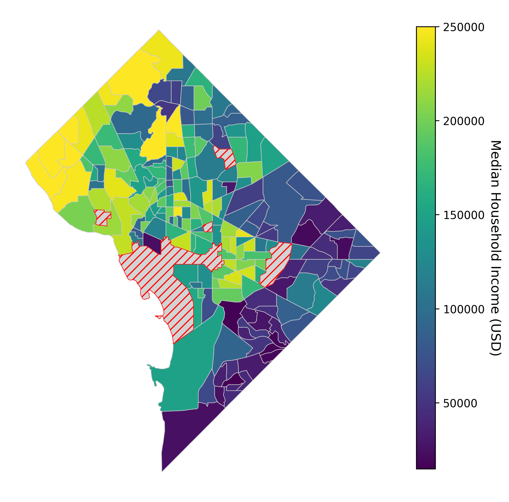
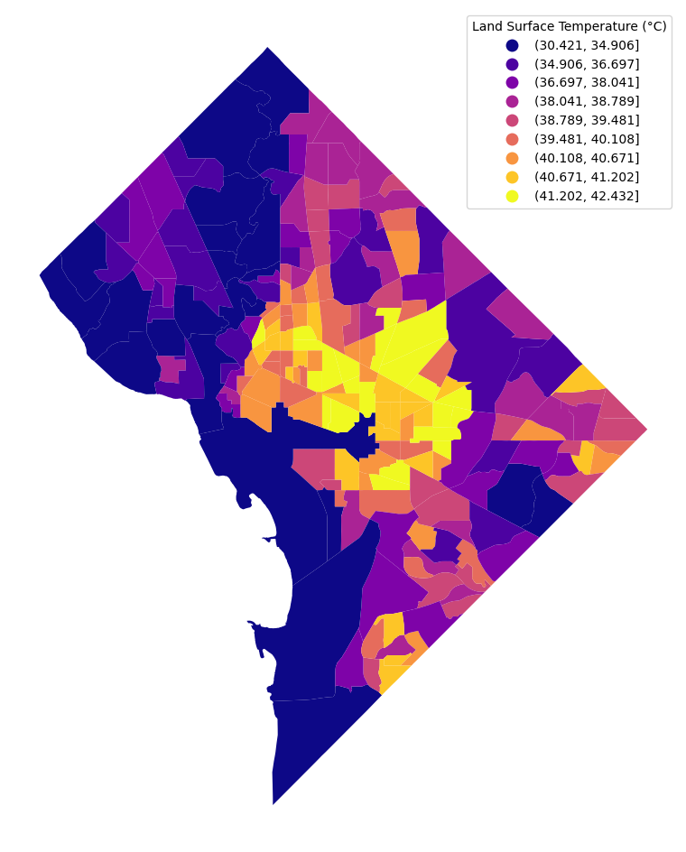
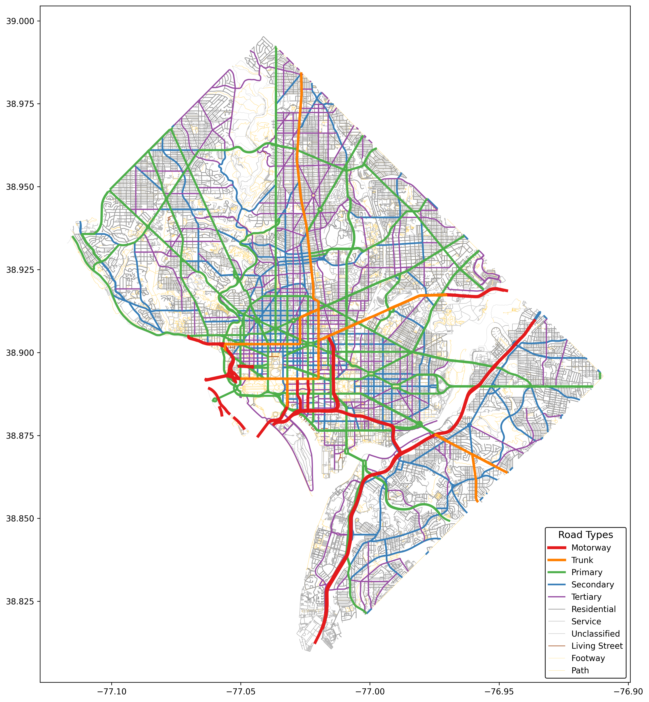
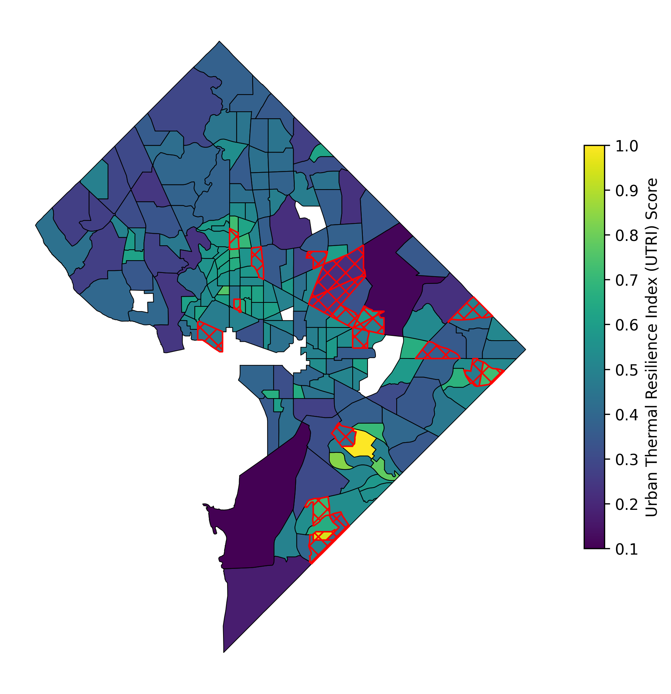
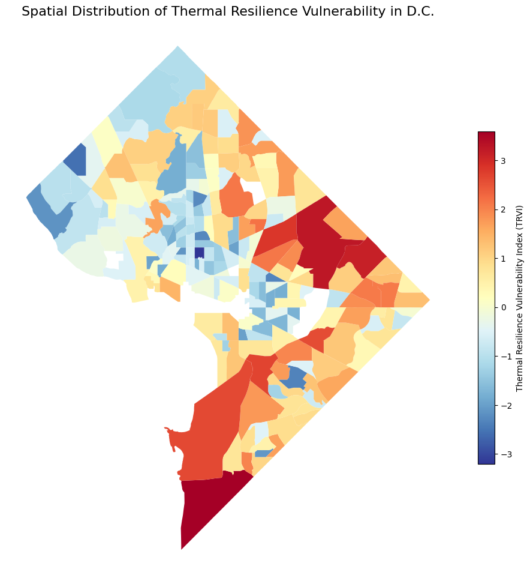

# The Structural Roots of Thermal Inequity: Linking Street Network Thermal Resilience to Socioeconomic Vulnerability


~ **Note！** The data and code has fully updated, and the README will be fully updated within a week (before 24th November).

## Paper on arXiv
url: 

## Abstract
As climate change intensifies urban extreme heat events, the role of street network topology in perpetuating thermal inequity remains under-quantified, which is a critical factor governing heat accumulation and dissipation. This paper introduces the Urban Thermal Resilience Index (UTRI), a novel metric grounded in network science principles of permeability, hierarchy, and decentralization, designed to assess the intrinsic heat ventilation potential of street networks. Applying this index to Washington, D.C., we analyze its relationship with socioeconomic data by integrating street network information from OpenStreetMap (OSM) and community data from the American Community Survey (ACS). Our findings reveal a significant positive spatial correlation between a network's thermal resilience and the median household income of its community. Specifically, the structurally deficient street networks with poor thermal performance are disproportionately co-located with socioeconomically vulnerable neighborhoods. This research provides a new perspective on the structural roots of urban thermal vulnerability, using quantitative evidence from the Thermal Risk Vulnerability Index (TRVI), which reveals that the distribution of heat risk is a critical environmental justice issue embedded in street network planning.

<table align="center" style="border: none; margin: 0 auto;">
  <tr style="background-color: transparent;">
    <td align="center" style="border: none; padding: 10px;">
      
      <br>
      <i>(a) Median household income</i>
    </td>
    <td align="center" style="border: none; padding: 10px;">
      
      <br>
      <i>(b) Land Surface Temperature (LST)</i>
    </td>
    <td align="center" style="border: none; padding: 10px;">
      
      <br>
      <i>(c) Street network</i>
    </td>
  </tr>
</table>

> **Foundational Geospatial Datasets in Washington, D.C. (2022).** From left to right: (a) median household income by census tract, (b) average summer surface temperature, and (c) OpenStreetMap street network.
<br>

## Methodology & Workflow

The methodology of this study comprises four principal stages: data collection, indicator calculation, spatial analysis, and visualisation.

### Step One: Data Collection and Preprocessing

#### Project Structure
```
.
├── ACS_DATA/               # 1. Code for acquiring and processing socioeconomic data from the United States Census Bureau's American Community Survey (ACS)
├── Climate_DATA/           # 2. Code for acquiring and processing climate data (such as surface temperature)
├── OSM_DATA/               # 3. Code for downloading and preprocessing road network data from OpenStreetMap
├── combine_ACS_and_OSM/    # 4. Core analytical code for data merging, metric calculation and spatial modelling
├── data/                   # Store all raw, intermediate and final datasets (.csv, .shp, .graphml)
├── result_img/             # Store all generated visualisations, maps and result images
├── tl_2022_11_tract.zip    # Original Shapefile geographic boundary files for the Washington, D.C. census tracts
└── README.md               # Project Specification Document
```

---
1.  **Socioeconomic Data (ACS)**:
    -   We utilised the United States Census Bureau's API to obtain **Median Household Income** data for each Census Tract within the District of Columbia.
    -   The relevant scripts are located in the `ACS_DATA/` folder.

2.  **Street Network Data (OSM)**:
    -   Downloaded the complete street network for Washington, D.C. from OpenStreetMap using the `OSMnx` library.
    -   Cleaned the network data, extracting key attributes such as road type and length.
    -   Relevant scripts are located in the `OSM_DATA/` folder.

3.  **Climate Data (LST)**:
    -   Obtained summer **Land Surface Temperature (LST)** data for the study area via Google Earth Engine (GEE) as the dependent variable.
    -   Relevant scripts are located in the `Climate_DATA/` folder.

**Table 1: Descriptive Statistics of Key Variables (n = 206)**

| Variable         | Mean    | Std. Dev. | Min     | Max      |
|:-----------------|--------:|----------:|--------:|---------:|
| MHI ($)          | 114,541 | 55,238    | 14,827  | 250,001  |
| LST (°C)         | 38.45   | 2.89      | 30.42   | 42.43    |
| UTRI Score (EWM) | 0.49    | 0.18      | 0.10    | 1.00     |

### Step Two: Calculation of Core Metrics

The core analysis script is located in the `combine_ACS_and_OSM/` folder.

#### 1. Urban Thermal Resilience Index (UTRI)

UTRI is a composite index designed to quantify the structural capacity of street networks to either promote or inhibit urban ventilation and heat dissipation. It is based on four network science metrics, weighted through the **Entropy Weight Method (EWM)** to objectively assess the significance of each indicator.

| Indicator                  | Description                                                               | Effect on thermal Resilience |
| --------------------------------- | ------------------------------------------------------------------ | -------------- |
| **Global Permeability**           | The overall connectivity and efficiency of the network, measuring the smoothness of air and traffic flow.               | **positive (+)**   |
| **Average Clustering** | The degree of localised clustering within the network. High clustering implies the presence of numerous enclosed or semi-enclosed blocks, which is detrimental to ventilation. | **negative (-)**   |
| **Degree Assortativity**          | The hierarchical nature of networks. Highly stratified networks (with clearly defined primary and secondary routes) typically exhibit greater resilience.    | **positive (+)**   |
| **Gini of Edge Betweenness**      | Assessing the uniformity of network traffic distribution. A decentralised network can disperse heat and airflow more evenly. | **negative (-)**   |

#### 2. Thermal Risk Vulnerability Index (TRVI)

TRVI is a composite vulnerability index that combines the sensitivity of the built environment (as measured by UTRI) with socio-economic vulnerability (measured in this study by median household income, MHI).

$TRVI = f (UTRI, MHI)$

This index aims to identify **'double-risk'** areas where not only is the street network structure detrimental to heat dissipation, but residents also have lower socioeconomic status and weaker adaptive capacity.

### Step Three: Spatial Statistical Analysis

We employed spatial statistical models to validate the indicators' validity and investigate the spatial relationships between variables.

-   **Global Moran's I**: Used to test whether variables such as UTRI, TRVI, and median household income exhibit spatial autocorrelation (i.e., patterns of clustering or dispersion).
-   **Geographically Weighted Regression (GWR)**: Further analysis of the localised impact of road network structure indicators on land surface temperature (LST) revealed variations in the influence of different built environment indicators across distinct urban areas.

## Experiments and Results
### 1. The coupling relationship between the environment and socio-economic factors
Our analysis reveals a clear positive correlation between the thermal performance of Washington, D.C.'s street networks and community wealth levels. Affluent neighbourhoods typically exhibit greater 'thermal resilience' (higher UTRI scores) in their street networks, whereas low-income communities generally correspond to poorly ventilated, heat-trapping street layouts.

<p align="center">
  
  <br>
  <b> </b> <i>Spatial Distribution of Socio-Thermal Vulnerability Hotspots</i>
</p>

### 2. Spatial Inequality in Heat Risk Vulnerability
TRVI spatial distribution maps clearly delineate the 'hotspot' areas within cities. These high-vulnerability zones exhibit not only poor physical environments but also lower socio-economic status, forming a classic case of environmental injustice.

<p align="center">
  
  <br>
  <b> </b> <i>Spatial Pattern of Thermal Resilience Vulnerability</i>
</p>

## How to Reproduce by yourself

1.  **Environment Configuration**:
    -   Clone this repository: `git clone https://github.com/STRGNAILab/UTRI-pro.git`
    -   `python >= 3.8` 
    -   Install all dependencies. The primary dependency libraries include:: `geopandas`, `osmnx`, `networkx`, `matplotlib`, `seaborn`, `scikit-learn`, `mgwr`, `earthengine-api`.

2.  **Execution steps**:
    -   **Data Preparation**: Execute the code in the `OSM_DATA/`, `ACS_DATA/`, and `Climate_DATA/` folders sequentially to download and preprocess all required data.
    -   **Core Analysis**: Run the main analysis script in the `combine_ACS_and_OSM/` folder to compute metrics, perform statistical analyses, and generate all charts.
    -   All generated results will be saved in the `result_img/` folder, with the final analysed dataset stored in the `data/` folder.

## Citation

If you utilise data or code from this project in your research, please cite our paper.
We thank you for your interest in our work.


